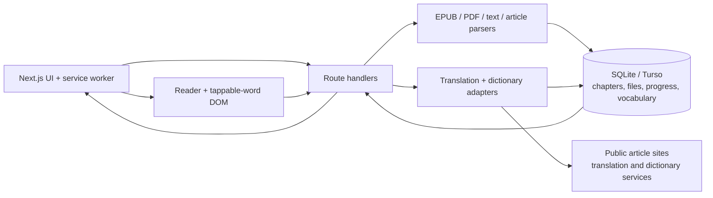
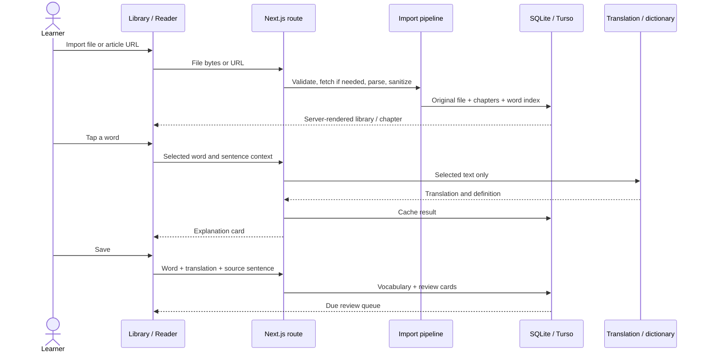

# Mountain — reading that becomes learning

English learners often stop reading when unfamiliar words repeatedly break the
story. Mountain keeps the text and the help on one surface: tap a word for a
translation and explanation, save it in its original sentence, then review it
later. Kazakh is the default, with seven other target languages available.

## Short demo: import → understand → save → review

This is a 30-second, repeatable demo rather than a highlight reel. Start in a
fresh library so every state is visible.

| Time | Action | What the viewer sees |
| --- | --- | --- |
| 0–5s | Drop a small EPUB onto **Add a file**. | The imported book appears on the shelf without a loading-state jump; open it. |
| 5–12s | Tap *ridge* in chapter one. | A word card opens beside the sentence with translation, pronunciation, definition, and usage. |
| 12–18s | Choose **Save to vocabulary**. | The word is underlined in the text and its sentence is retained as context. |
| 18–24s | Open **Vocabulary**. | The saved word appears as recognition, production, and fill-in-the-blank cards. |
| 24–30s | Answer a card, then return to the library. | The review is scheduled and reading progress remains where the learner stopped. |

For a recorded version, keep the pointer visible, do not cut between the tap and
the explanation, and use the same local EPUB each time so the run is reproducible
without a network-dependent article or catalog import. If no fixture is available,
**Read the sample** exercises the same reader, save, and review path.

## What I built

The reader accepts EPUB, PDF, text, Markdown, subtitle, and web-article imports.
It parses them into sanitized chapters on the server, which makes every word a
tap target without allowing scripts, styles, or remote resources from a book
onto the reading surface. A SQLite FTS5 index supports in-book search, and a
lemma index connects inflected forms to coverage and known words.

Each browser starts with an anonymous account. A one-use code can link another
device without a password. libSQL stores parsed text, progress, vocabulary, and
the original uploaded bytes; development uses a local SQLite file and deployment
uses Turso. Opened chapters are cached by the service worker for offline reading.

### Architecture

### Data flow

## Storage, privacy, and retention

- The original uploaded file, sanitized chapters, progress, known words, and
  vocabulary live in the app database. An article import stores its normalized
  source URL and extracted text, but not the original web response.
- A random, HTTP-only session cookie is the account credential. The database
  stores its hash, not the token. There is no email or profile data in the
  current sign-in model.
- Files and libraries are scoped to an account and are not public. When a learner
  asks for an explanation, only the selected word or passage is sent to the
  configured translation and dictionary providers—not the whole document.
- Data has no automatic expiry. Removing a book deletes its file bytes, parsed
  chapters, full-text/word indexes, and progress. Saved vocabulary remains for
  review with its book link cleared, until the learner deletes that vocabulary.
- Clearing every linked browser cookie makes the anonymous account unreachable;
  it does not itself erase the server-side data. Account recovery and complete
  account deletion are product gaps that should be closed before a public launch.

## Reliability evidence

The automated suite exercises failure-prone boundaries rather than only the
happy path. It includes malformed article markup, SSRF and redirect checks,
account-link races, database migrations, an EPUB with an encoded spine path and
missing item, a generated 180-page PDF, a damaged PDF, invalid UTF-8 text, and
unsupported file types. Import errors tell the reader whether a file is too
large, unsupported, damaged, password-protected, a scanned PDF without selectable
text, or an article that is unreachable/unreadable.

Run the evidence locally with `npm test`. The large-PDF regression verifies that
text from both the first and last page survives extraction.

## Usability evidence

No moderated user sessions have been completed yet, so this case study does not
claim findings it does not have. The five-participant protocol, observation
sheet, success criteria, and reporting template are in
[USABILITY-STUDY.md](USABILITY-STUDY.md). Results should replace this paragraph
only after the sessions are run; automated tests are reliability evidence, not
usability evidence.

## Limits and next steps

There is no account recovery after every linked browser loses its cookie, and no
self-service “delete account” control. Translation and dictionary detail depend
on free external services and may be slow or incomplete. Scanned PDFs need OCR.
A public launch also needs upload and translation quotas. The next research step
is to run the five sessions in the prepared protocol, prioritize observed
breakdowns, make changes, and report the before/after task results.
